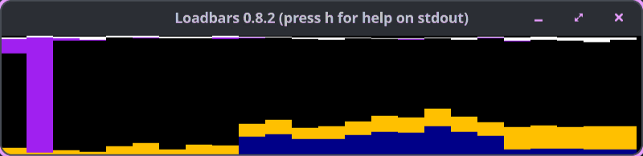

# loadbars - A small and humble tool to observe server loads

## Description

Loadbars is a tool that can be used to observe CPU loads of several remote servers at once in real time. It connects with SSH (using SSH public/private key auth) to several servers at once and vizualizes all server CPUs and memory statistics right next each other (either summarized or each core separately). Loadbars is not a tool for collecting CPU loads and drawing graphs for later analysis. However, since such tools require a significant amount of time before producing results, Loadbars lets you observe the current state immediately. Loadbars does not remember or record any load information. It just shows the current CPU usages like top or vmstat does.



**Read the [usage guide](docs/usage-guide.md)** for everything else: every feature explained with an animated GIF, how to watch many remote servers at once, and the full hotkey and option reference.

### Tested platforms

This version of loadbars has been tested on:
- Fedora Linux 43 and most modern Linux distributions (RHEL, CentOS, Ubuntu, Debian, etc.)
- macOS (Darwin) - can connect to remote Linux servers via SSH (local monitoring not supported)

**Note:** Local monitoring requires Linux with /proc filesystem. Remote hosts must be Linux (using /proc filesystem). macOS can be used as a client to monitor remote Linux servers.

## Build and run

### SDL2 Dependencies

Loadbars requires SDL2 for the display window. Install it for your platform:

#### Fedora Linux / RHEL / CentOS

```bash
sudo dnf install SDL2-devel
```

#### Ubuntu / Debian

```bash
sudo apt install libsdl2-dev
```

#### macOS

```bash
brew install sdl2
```

### Using Mage (recommended)

Build the binary:

```bash
mage build
./loadbars --hosts localhost
```

Install to GOPATH/bin (e.g. ~/go/bin):

```bash
mage install
```

Run tests:

```bash
mage test
```

Or build without Mage: `go build -o loadbars ./cmd/loadbars`.

## Usage

```bash
loadbars                                    # this machine, no SSH needed
loadbars --hosts server1,root@server2       # remote servers over SSH
loadbars server{01..20}.example.com --showmem --shownet
loadbars --cluster production               # hosts from /etc/clusters
```

Remote servers need Linux and bash, nothing else; loadbars streams its collector script over SSH. SSH must work without a password prompt (key auth, agent running).

Run `loadbars --help` for all options and press `h` in the window to print the hotkeys. Options can also be stored in `~/.loadbarsrc` (press `w` to save the current view). The [usage guide](docs/usage-guide.md) explains all of it:

- [CPU bars](docs/usage-guide.md#2-cpu-bars), [memory](docs/usage-guide.md#4-memory), [network](docs/usage-guide.md#5-network), [load average](docs/usage-guide.md#6-load-average), [disk I/O](docs/usage-guide.md#7-disk-io)
- [Multiple remote servers](docs/usage-guide.md#9-multiple-remote-servers) and [large fleets](docs/usage-guide.md#10-large-fleets-wrapping-into-rows)
- [Hotkeys](docs/usage-guide.md#12-reference-hotkeys) and [options and config keys](docs/usage-guide.md#13-reference-options-and-config-keys)

## License

See package description or project website.

The Go build of loadbars links to **go-sdl2** (github.com/veandco/go-sdl2), which is licensed under the **BSD-3-Clause** license. That license is compatible with loadbars' use and does not impose additional restrictions on distribution. The full copyright notice and license text for go-sdl2 are in the [LICENSE](LICENSE) file.

## Author

Paul Buetow - <http://paul.buetow.org>
