# Loadbars usage guide

Loadbars shows the current CPU, memory, network, load average and disk I/O of
one or many Linux servers as coloured bars in a small window. It keeps no
history: like `top` or `vmstat`, it shows what is happening right now, and it
does so for dozens of servers side by side.

This guide walks through every feature. Each section has an animated GIF: the
strip at the top of the GIF shows the command that was run, and the strip at
the bottom says which key is being pressed. Those strips are only in the GIFs;
the loadbars window itself shows nothing but bars (plus a tooltip when you
hover over one). Messages, such as the confirmation after pressing a key, are
printed to the terminal you started loadbars from.

1. [Quick start](#1-quick-start)
2. [CPU bars](#2-cpu-bars)
3. [Extended mode: the peak line](#3-extended-mode-the-peak-line)
4. [Memory](#4-memory)
5. [Network](#5-network)
6. [Load average](#6-load-average)
7. [Disk I/O](#7-disk-io)
8. [Hover tooltips](#8-hover-tooltips)
9. [Multiple remote servers](#9-multiple-remote-servers)
10. [Large fleets: wrapping into rows](#10-large-fleets-wrapping-into-rows)
11. [Window size and the config file](#11-window-size-and-the-config-file)
12. [Reference: hotkeys](#12-reference-hotkeys)
13. [Reference: options and config keys](#13-reference-options-and-config-keys)
14. [How the GIFs in this guide are made](#14-how-the-gifs-in-this-guide-are-made)

---

## 1. Quick start

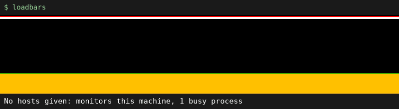

Build it (needs Go and the SDL2 development package, see the
[README](../README.md#build-and-run)) and run it without arguments:

```bash
mage build          # or: go build -o loadbars ./cmd/loadbars
./loadbars
```

With no hosts given, loadbars monitors the local machine directly, without SSH
(the same happens for a host named `localhost` or `127.0.0.1`). You get one bar
for the whole CPU. In the GIF, a four-core machine first runs one busy process,
then three, then four, and the bar fills up with yellow (user time). When the
processes stop, the bar drains back to black (idle).

Press `h` at any time to print the hotkeys to the terminal, and `q` to quit.

Local monitoring needs Linux (`/proc`). On macOS loadbars works as a client that
watches remote Linux servers over SSH (see [section 9](#9-multiple-remote-servers)).

## 2. CPU bars

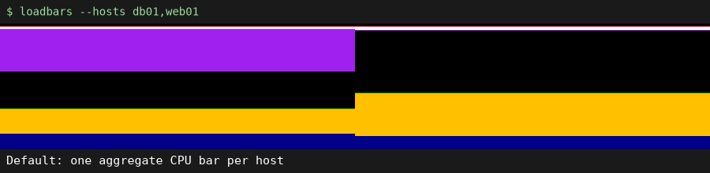

By default each host gets one aggregate CPU bar. Press `1` to cycle through the
three CPU modes:

| Mode | Shows | Flag / config key |
|------|-------|-------------------|
| Aggregate (default) | one bar per host | `--cpumode 0` |
| Per-core | the aggregate bar plus one bar per core | `--cpumode 1` or `--showcores` |
| Off | no CPU bars (useful to look at memory or disks only) | `--cpumode 2` |

Each bar is 100% of the CPU time, split into coloured segments that are
stacked from the bottom up in this order:

| Colour | Meaning |
|--------|---------|
| Blue | system (`sy`) |
| Yellow | user (`us`) |
| Green | nice (`ni`) |
| Lime green | guest nice |
| Black | idle (`id`) |
| Purple | iowait (`io`), time waiting for disks |
| White | IRQ and soft IRQ |
| Red | guest and steal (`st`), time taken by the hypervisor |

Because idle (black) sits in the middle of the stack, work grows up from the
bottom and waiting grows down from the top. So a bar that is mostly black is an
idle host, yellow and blue at the bottom means real work, purple at the top
means the host is waiting for storage, and red at the top on a VM means the
hypervisor is short on CPU. In the GIF, `db01` has 8 cores and a lot of iowait,
`web01` has 4 cores busy with user time.

## 3. Extended mode: the peak line

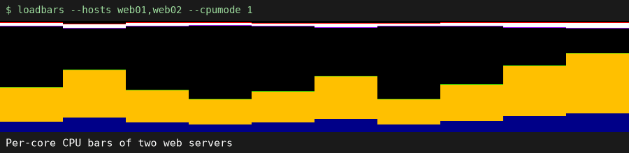

Press `e` (or start with `--extended`) to add a 1px peak line to every CPU bar.
It marks the highest system+user value of the last few screen updates, so a
short spike stays visible for a moment after the bar has dropped again. The
line changes colour with the peak: yellow, dark yellow above 50%, orange above
70%.

How long the peak is remembered is set by the CPU sample count, 10 by default
(`--cpuaverage`). The screen updates about seven times a second, so 10 samples
is roughly 1.5 seconds. Press `a` for more samples (a longer memory) and `y` for
fewer (the line follows the bar more closely). In the GIF, `y` is pressed three
times and the peak lines start to hug the bars.

All bars glide smoothly to each new value instead of jumping; that smoothing is
built in and not adjustable. The `d` / `c` (`--netaverage`) and `b` / `x`
(`--diskaverage`) keys change the network and disk sample counts, which are
saved with `w` but currently have no visible effect.

In extended mode disk bars also get a utilisation line
([section 7](#7-disk-io)).

## 4. Memory

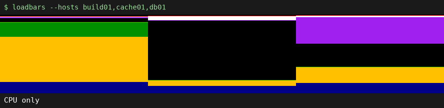

Press `2` or `m` (or start with `--showmem`) to add one memory bar per host,
right after its CPU bars. Both halves grow up from the bottom: the left half is
RAM used (grey), the right half is swap used (light grey), each as a percentage
of the total. Used memory is `MemTotal - MemFree`, so Linux page
cache counts as used; the hover tooltip ([section 8](#8-hover-tooltips)) shows
the absolute numbers.

In the GIF `cache01` and `db01` keep most of their RAM in use and `cache01`
also uses some swap, while the RAM of `build01` jumps whenever a build starts.

## 5. Network

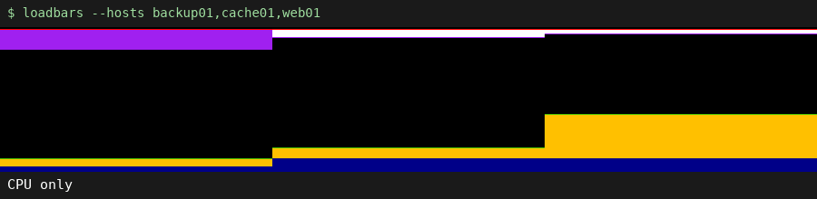

Press `3` or `n` (or `--shownet`) to add a green network bar per host. It sums
all interfaces except `lo`:

* the **left half, growing down from the top**, is received traffic (RX),
* the **right half, growing up from the bottom**, is transmitted traffic (TX).

Both are a percentage of a link speed reference, 1 Gbit/s by default. A full
half means the host is sending or receiving at the reference speed. Set the
reference to what your servers have with `--netlink` (`mbit`, `10mbit`,
`100mbit`, `gbit`, `10gbit`, or a number of Mbit/s such as `2500`), or step
through those five speeds live with `f` (faster) and `v` (slower). The GIF drops the reference to 100 Mbit/s with
`v` and the same traffic now fills the bars.

A bar that is completely red means the host has no network interface other
than `lo`.

## 6. Load average

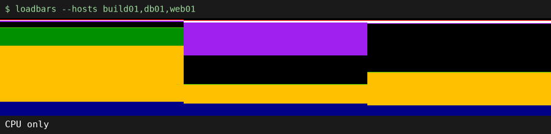

Press `4` or `l` (or `--showload`) to add a load average bar per host:

* the **teal fill from the top** is the 1-minute load,
* the **yellow 1px line** is the 5-minute load,
* the **white 1px line** is the 15-minute load.

When the load is rising, the 5 and 15-minute lines sit inside the 1-minute
fill; when it is falling, they hang below it. That makes it easy to see whether
a host is getting busier or calming down.

All load bars share one scale so hosts are comparable. By default it adapts:
the full height is the highest 1-minute load seen across all hosts (at least
2.0), decaying slowly. Press `r` to reset it to 2.0 after a spike. To get a
fixed scale, for example the core count, use `--loadmax 8`; the tooltip then
shows `Max:` instead of `Peak:`.

## 7. Disk I/O

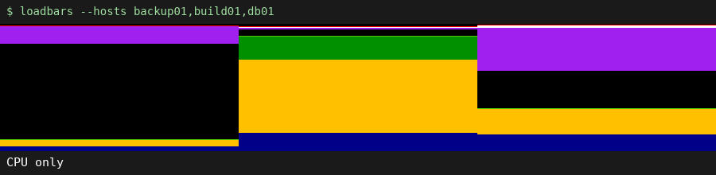

Press `5` (or `--diskmode 0`) to add disk I/O bars. Pressing `5` cycles through:

| Mode | Shows | Flag / config key |
|------|-------|-------------------|
| Aggregate | one bar per host, all disks summed | `--diskmode 0` |
| Per-device | one bar per whole disk (`sda`, `nvme0n1`, ...) | `--diskmode 1` |
| Off (default) | no disk bars | `--diskmode 2` |

An idle disk bar is a dim purple, so you can tell it apart from the black
background. Reads fill from the top (purple) and writes from the bottom (dark
purple); each can take up at most half of the bar. Partitions, loop, ram, zram
and device-mapper devices are ignored so nothing is counted twice. In extended
mode (`e`) a light red line shows utilisation, the share of time the disk was
busy: it moves down from the top, from 0% at the top to 100% at the bottom.

The scale adapts to the highest read+write throughput seen on any disk (at
least 1 MB/s) and slowly decays again; `r` resets it to 1 MB/s, and
`--diskmax <bytes/sec>` fixes it (for example `--diskmax 500000000` for
500 MB/s). The tooltip shows `Max:` for a fixed scale and `Peak:` otherwise. In the GIF, `db01` has two NVMe drives
under constant write load and `backup01` reads in bursts.

## 8. Hover tooltips

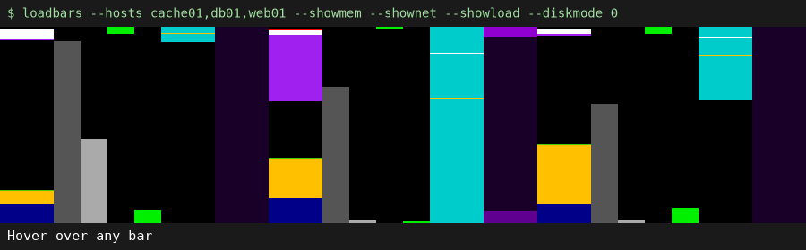

Move the mouse over any bar to see its exact values. Every bar of that host is
drawn in inverted colours at the same time, so you can tell which host a bar
belongs to:

| Bar | Tooltip |
|-----|---------|
| CPU | host and core, then system, user, nice, iowait, steal and idle % |
| Memory | RAM and swap used / total, in GB and % |
| Network | RX and TX as % of the link reference, and the reference |
| Load | 1, 5 and 15-minute load and the current scale |
| Disk | device (`all` in aggregate mode), read and write MB/s and the current scale |

The tooltip and highlight disappear after three seconds without mouse movement.

## 9. Multiple remote servers

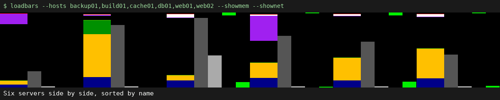

Loadbars is made for watching several servers at once. Give it the hosts and it
opens one SSH connection per host and puts them next to each other:

```bash
loadbars --hosts web01,web02,db01
loadbars web01 web02 db01 --showmem        # hosts as arguments
loadbars root@web01,deploy@db01            # a different user per host
loadbars web{01..12}.example.com           # shell brace expansion
loadbars --cluster production              # hosts from /etc/clusters
```

**How it connects.** Loadbars runs `ssh host bash -s` and sends a small
built-in shell script over stdin. The script reads `/proc` and streams the
numbers back: CPU about seven times a second, memory, network, load and disk
about every three seconds. Nothing has to be installed on the servers: they only
need bash and Linux. SSH must work without a password prompt (key in
`~/.ssh/authorized_keys`, agent running). Loadbars passes
`-o StrictHostKeyChecking=no`, so the key of a host you have never connected to
is accepted without asking. Extra SSH options go in `--sshopts`,
for example `--sshopts "-o ConnectTimeout=5 -p 2222"`; everything in
`~/.ssh/config` (jump hosts, ports, users) applies too. If a connection fails
or drops, loadbars reconnects with a backoff of up to 30 seconds and prints the
error to the terminal.

**Clusters.** `--cluster <name>` reads a ClusterSSH-style `/etc/clusters` file,
where each line is a cluster name followed by hosts or other cluster names
(`--cluster` can be combined with `--hosts`; the hosts are added together):

```
web        web01 web02 web03
db         db01 db02
production web db
```

**Reading many hosts at once.** Hosts are always sorted by name, and each host
gets the same group of bars (CPU, then memory, network, load, disk). These
help when there are many of them:

* `s` (or `--showseparators`) draws a red line between hosts.
* `g` (or `--showavgline`) draws a red horizontal line at the average CPU usage
  of all hosts, so the hosts above the fleet average stand out.
* `i` (or `--showioavgline`) draws a pink line at the average iowait+IRQ of all
  hosts. It is measured from the top of the window, like the purple and white
  segments of the CPU bars it summarises.
* Hovering highlights the whole host ([section 8](#8-hover-tooltips)).
* `--title "prod web"` names the window, handy with several loadbars windows.

Give related hosts names that sort together (`web01`, `web02`, ...) and they
will sit next to each other in the window.

## 10. Large fleets: wrapping into rows

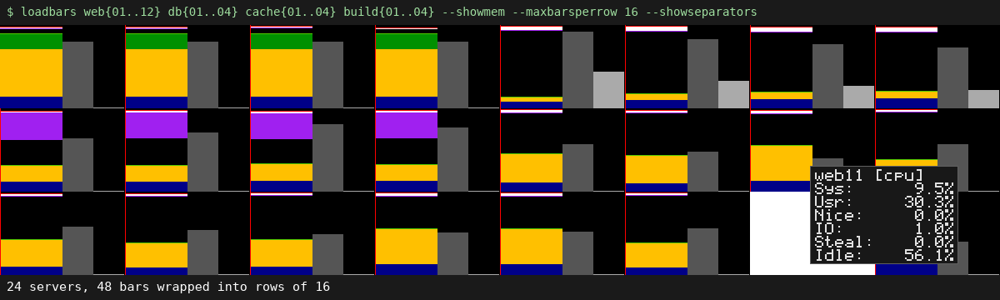

With many hosts a single row of bars gets too thin. `--maxbarsperrow <n>` wraps
the bars into rows of at most `n` bars, each row getting an equal share of the
window height (a taller window helps: `--height 300`). A short last row gets
wider bars. In the GIF 24 servers with CPU and memory bars (48 bars) are shown
in three rows of 16:

```bash
loadbars web{01..12} db{01..04} cache{01..04} build{01..04} \
  --showmem --maxbarsperrow 16 --showseparators --height 300
```

As a rule of thumb, keep bars at least 20 to 30 pixels wide. Per-core mode on a
large fleet multiplies the number of bars by the core count, so use it on a few
hosts at a time.

## 11. Window size and the config file

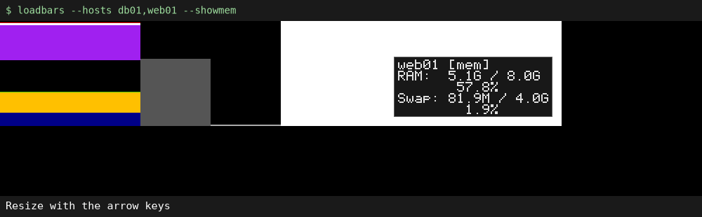

The window starts `--barwidth` pixels wide (default 1200, at least 800) and
`--height` pixels high (default 150). Resize it with the mouse or the arrow
keys: right/left make it 100px wider/narrower (up to `--maxwidth`, default
1900), down/up make it 100px taller/shorter.

Every option can also live in `~/.loadbarsrc`, one `key=value` per line,
without the leading `--`, `#` starts a comment. Command-line flags override the
file.

```
# ~/.loadbarsrc
showmem=1
shownet=1
netlink=10gbit
cpumode=0
showseparators=1
sshopts=-o ConnectTimeout=5
```

Press `w` to write the current settings to `~/.loadbarsrc`: which bars are on,
extended mode, the sample counts, the link speed, the current window size and
every other option you started with, except `--title` and the host list. The
next start then looks the same. This overwrites the file, including comments.
A `cluster` you started with is saved too and will be added to the hosts on
every later start until you remove it from the file.

## 12. Reference: hotkeys

| Key | Action |
|-----|--------|
| `1` | CPU: aggregate, per-core, off |
| `2` / `m` | Memory bars on/off |
| `3` / `n` | Network bars on/off |
| `4` / `l` | Load average bars on/off |
| `5` | Disk: aggregate, per-device, off |
| `e` | Extended mode (CPU peak line, disk utilisation line) |
| `g` | Global CPU average line |
| `i` | Global iowait+IRQ average line |
| `s` | Separator lines between hosts |
| `r` | Reset the load and disk auto-scale |
| `a` / `y` | Longer / shorter peak line history (CPU samples) |
| `d` / `c` | More / fewer network samples (no visible effect yet) |
| `b` / `x` | More / fewer disk samples (no visible effect yet) |
| `f` / `v` | Network link reference up / down |
| Arrow keys | Resize the window by 100px |
| `w` | Save the current settings to `~/.loadbarsrc` |
| `h` | Print the hotkeys to the terminal |
| `q` | Quit |

## 13. Reference: options and config keys

Every flag below is also a `~/.loadbarsrc` key (without `--`), except `hosts`,
`help` and `version`. Boolean flags take no value on the command line
(`--showmem`, or `--showmem=false` to override the config file); in the config
file use `1` or `0` (`true`/`yes` work too).

| Flag | Default | Description |
|------|---------|-------------|
| `--hosts <list>` | localhost | Comma-separated hosts, optionally `user@host` |
| `--cluster <name>` | | Hosts from `/etc/clusters` |
| `--cpumode <n>` | 0 | 0 aggregate, 1 per-core, 2 off |
| `--showcores` | | Same as `--cpumode 1` (`showcores=0` in the file means `--cpumode 0`) |
| `--showmem` | off | Memory bars |
| `--shownet` | off | Network bars |
| `--showload` | off | Load average bars |
| `--diskmode <n>` | 2 | 0 aggregate, 1 per-device, 2 off |
| `--extended` | off | Peak and utilisation lines |
| `--showavgline` | off | Global CPU average line |
| `--showioavgline` | off | Global iowait+IRQ average line |
| `--showseparators` | off | Lines between hosts |
| `--netlink <speed>` | gbit | `mbit`, `10mbit`, `100mbit`, `gbit`, `10gbit` or a number of Mbit/s |
| `--loadmax <n>` | 0 | Fixed load scale (0 = auto) |
| `--diskmax <n>` | 0 | Fixed disk scale in bytes/s (0 = auto) |
| `--cpuaverage <n>` | 10 | CPU samples kept for the peak line |
| `--netaverage <n>` | 15 | Network sample count (no visible effect yet) |
| `--diskaverage <n>` | 10 | Disk sample count (no visible effect yet) |
| `--barwidth <n>` | 1200 | Initial window width (min 800) |
| `--height <n>` | 150 | Window height |
| `--maxwidth <n>` | 1900 | Maximum window width |
| `--maxbarsperrow <n>` | 0 | Wrap into rows of n bars (0 = one row) |
| `--title <text>` | | Window title |
| `--sshopts <opts>` | | Extra `ssh` options |
| `--hasagent` | | Accepted for compatibility, no effect |
| `--help`, `--version` | | |

## 14. How the GIFs in this guide are made

All GIFs are recorded by [`scripts/record-guide-gifs.py`](../scripts/record-guide-gifs.py):
it runs the real loadbars binary in a headless X server (Xvfb), presses keys and
moves the mouse with `xdotool`, and records with `ffmpeg`.

The remote servers in the GIFs are simulated. [`scripts/demo/ssh`](../scripts/demo/ssh)
stands in for `ssh` and streams a made-up but plausible load for each host,
picked by name: `web*` hosts serve traffic, `db*` hosts wait on two NVMe
drives, `cache*` hosts are full of RAM and network traffic, `build*` hosts run
CPU bursts, and `backup*` hosts read in bursts. You can use it to try loadbars
with a fleet without having one:

```bash
PATH="$PWD/scripts/demo:$PATH" ./loadbars web01 web02 db01 cache01 build01 backup01 --showmem --shownet
```

To regenerate the GIFs after changing the display (needs Xvfb, xdotool, ffmpeg
and optionally gifsicle):

```bash
go build -o loadbars ./cmd/loadbars
./scripts/record-guide-gifs.py              # all of them, into docs/img/
./scripts/record-guide-gifs.py network      # just one
```
